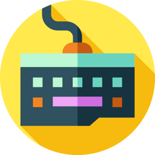

<h1>KEEB UTILS</h1>

<a href="https://www.flaticon.com/free-icons/computer-hardware" title="computer hardware icons">Computer hardware icons created by Rian Maulana - Flaticon</a>  
<a href="https://www.flaticon.com/free-icons/settings" title="settings icons">Settings icons created by Freepik - Flaticon</a>

## Table of Contents

[1. Introduction](#1-introduction)  
[2. Keyboard Layout](#2-keyboard-layout)  
[3. The Utils](#3-the-utils)  
. . [3.1. Utility Layer](#31-utility-layer)  
. . [3.2. Symbols Layer](#32-symbols-layer)  
[4. Supported Platforms and Software](#4-supported-platforms-and-software)  
. . [4.1. Linux](#41-linux)  
. . [4.2. Windows](#42-windows)  
[5. Credits and Inspiration](#5-credits-and-inspiration)  
[6. License](#6-license)

# 1. Introduction

Keeb Utils (‘Keyboard Utilities’) is a personal project aimed at sharing keyboard tweaks cross-platform; primarily Windows and Linux operating systems.

The repository contains my keyboard function customisations tailored for efficiency and comfort. Keeb Utils may provide a valuable resource for keyboard enthusiasts looking to enhance their typing experience. It may also serve as a starting point for people starting to get into keyboard programming.

Following my journey through alternative keyboard layouts and other layers implementing functions on the alphanumeric keys, I decided to create my own. Keeb Utils was inspired by other people – refer to [5 Credits and Inspiration](#5-credits-and-inspiration).

Keeb Utils follows these rules:

- Keep it minimal and functional.
- Implement solutions cross-platform without losing major functionalities.

# 2. Keyboard Layout

I type on a keyboard layout called ‘Colemak-DH’ (sometimes also referred to as ‘Colemak Mod-DH’). Colemak was developed in 2006 and later improved upon in 2015 (the ‘DH’ part) by replacing the D and H keys thus reducing lateral movement of the index fingers.

  
*Colemak-DH keymap for ANSI 101/104-key keyboards*

Note that some symbol keys (<kbd>[</kbd> <kbd>]</kbd> <kbd>=</kbd>) have been moved due to personal preference.

# 3. The Utils

I employ several tweaks or functions on additional layers to better accommodate my keyboard-centric workflow thus achieving better efficiency and comfort. These tweaks include:

- A utility layer containing quick access shortcut functions.
- A symbols layer containing quick access to programming and prose writing symbols.

## 3.1. Utility Layer

‘Utility’ is a keymap layer implemented for extra functionality of your keyboard. It is activated by a dedicated key (I prefer <kbd>Caps Lock</kbd>) to provide text editing and navigation functions on the alphanumeric keys without having to move your hands away from their home positions.

  
*Utility layer function map for ANSI 101/104-key keyboards*

## 3.2. Symbols Layer

‘Symbols’ is a keymap layer implemented for typing efficiency by more comfortable access to digits and other symbols. It also contains characters that are not accessible on traditional keyboard layouts (such as ‘non-[dumb](https://en.wikipedia.org/wiki/Typographic_approximation)’ quotation marks). Like Utility, this layer is activated by a dedicated key (I generally use <kbd>Alt</kbd>).

  
*Symbols layer characters for ANSI 101/104-key keyboards*

  
*Shift Symbols layer characters for ANSI 101/104-key keyboards*

# 4. Supported Platforms and Software

I've primarily created software solutions for GNU/Linux and Windows operating systems. The reason is that these are the two types of systems I use every day – Linux on my private devices, and Windows on my work computer. It is also important to keep in mind that I'm not allowed to install just any kind of software on my work machine; a business justification must be provided just about for any installation for ‘private use’. So I prefer to stick to open source and portable software.

### Important! I do _not_ provide the installers or any binary files that use the Keeb Utils configuration files contained in this repository. It is your responsibility to collect the corresponding software binaries.

## 4.1. Linux

#### Supported Software

- **KMonad** version >=0.4.1
- XKB (no extra layers)

## 4.2. Windows

#### Supported Software

- **AutoHotkey** version >2.0.1
- **KMonad** version >=0.4.1 (AutoHotkey is preferred)

**Planned:**

- MS KLC (no extra layers)

# 5. Credits and Inspiration

**Shai Coleman** – *[Colemak keyboard layout](https://colemak.com)*  
**Steve ‘stevep99’ P** – *[Seniply](https://stevep99.github.io/seniply/)*, *[Mod-DH](https://colemakmods.github.io/mod-dh/)*  
**Øystein ‘DreymaR’ Bech-Aase** – *[The Big Bag Theory](https://dreymar.colemak.org/)*  
**Manna Harbour** – *[Miryoku](https://github.com/manna-harbour/miryoku)*  
**Precondition** – *[Home Row Mods](https://precondition.github.io/home-row-mods)*  
**Pascal Getreuer** – *[Designing a Symbol Layer](https://getreuer.info/posts/keyboards/symbol-layer/index.html)*

# 6. License

All files under the `Assets` directory without a specified license are Public Domain, the rest are licensed under the MIT license – refer to `LICENSE` in the root directory.

You may change and/or distribute all files contained in this repository under their license requirements.

**Disclaimer:**  
THE SOFTWARE IS PROVIDED "AS IS", WITHOUT WARRANTY OF ANY KIND, EXPRESS OR IMPLIED, INCLUDING BUT NOT LIMITED TO THE WARRANTIES OF MERCHANTABILITY, FITNESS FOR A PARTICULAR PURPOSE AND NONINFRINGEMENT. IN NO EVENT SHALL THE AUTHORS OR COPYRIGHT HOLDERS BE LIABLE FOR ANY CLAIM, DAMAGES OR OTHER LIABILITY, WHETHER IN AN ACTION OF CONTRACT, TORT OR OTHERWISE, ARISING FROM, OUT OF OR IN CONNECTION WITH THE SOFTWARE OR THE USE OR OTHER DEALINGS IN THE SOFTWARE.
